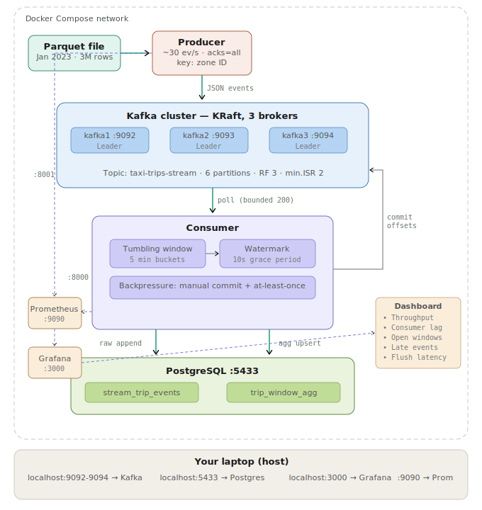
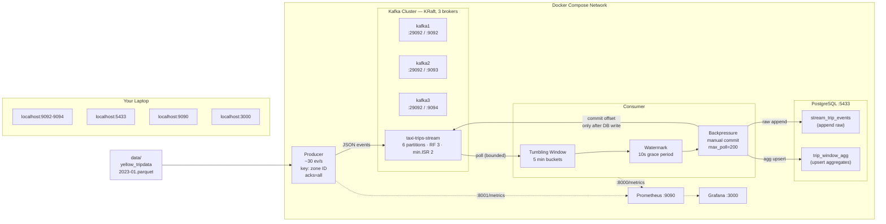
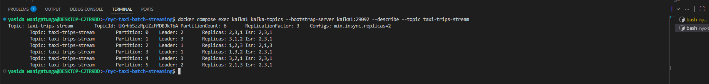
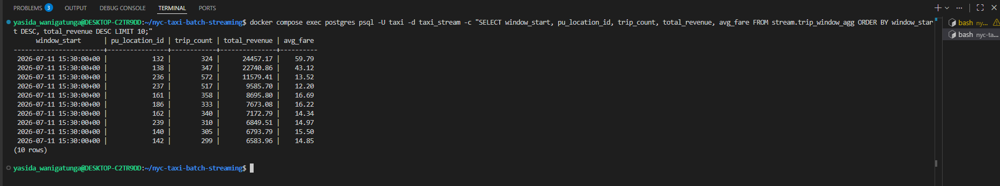
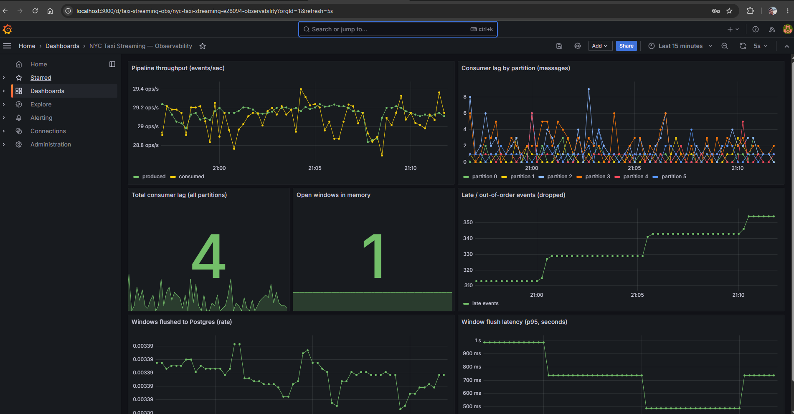
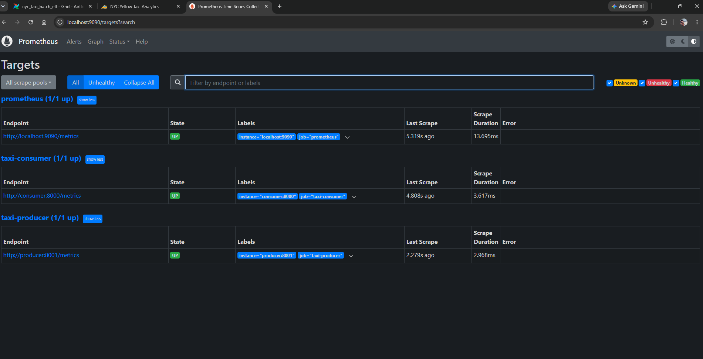
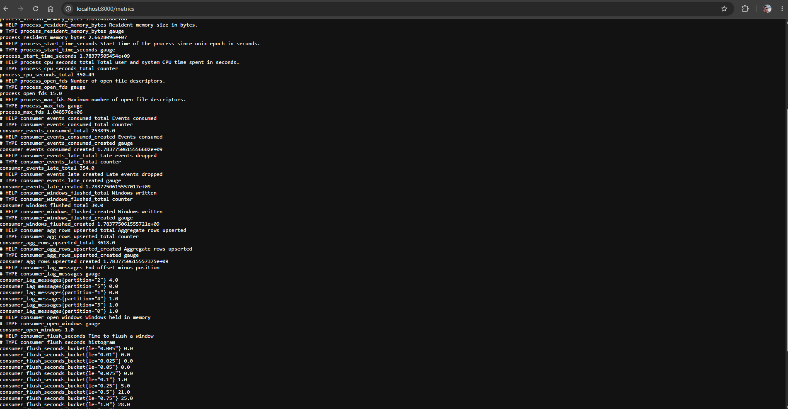

# NYC Taxi — Real-Time Streaming Pipeline

A local, end-to-end streaming stack: a Python producer replays NYC Yellow Taxi
records into a 3-broker Kafka cluster, a kafka-python consumer computes 5-minute
tumbling-window aggregates with watermark-based out-of-order handling and
backpressure-safe manual commits, writes raw events and upserts aggregates into
PostgreSQL, and exposes metrics to Prometheus and Grafana.

## Stack
| Component | Technology |
|---|---|
| Message broker | Apache Kafka, 3-broker cluster (KRaft, no ZooKeeper) |
| Producer | Python + kafka-python |
| Stream processing | kafka-python consumer, tumbling window + watermark |
| OLAP sink | PostgreSQL 16 |
| Observability | Prometheus + Grafana |
| Infra | Docker Compose |

## System Architecture






### Data flow — step by step

1. **Producer** reads the NYC parquet and pushes JSON events at ~30 ev/s, keyed by pickup zone
2. Events land on one of **6 partitions** — key hash determines which, so all events for one zone hit the same partition
3. **Consumer** polls bounded batches of 200 records (`max_poll_records`)
4. Each event is bucketed into a **5-minute tumbling window** by its event-time (not arrival time)
5. **Watermark** = max event-time seen minus 10 seconds. A window flushes only once its end is behind the watermark
6. On flush: raw events **appended** to `stream_trip_events`, aggregates **upserted** into `trip_window_agg` in one transaction
7. Offsets are committed **only after Postgres confirms** — if the DB slows, the consumer slows, but never drops events
8. **Prometheus** scrapes both `/metrics` endpoints every 5s; **Grafana** visualizes throughput, lag, windows, latency, and late events


## Quick start
```bash
chmod +x setup.sh
./setup.sh
docker compose logs -f producer consumer
```
The parquet is shipped in `data/`, so no external download is needed.

| Service | URL |
|---|---|
| Grafana | http://localhost:3000 (admin/admin) |
| Prometheus | http://localhost:9090 |
| Consumer metrics | http://localhost:8000/metrics |
| Postgres | localhost:5433, db `taxi_stream`, user/pw `taxi` |

See the aggregates fill:
```bash
docker compose exec postgres psql -U taxi -d taxi_stream \
  -c "SELECT * FROM stream.latest_window_leaderboard LIMIT 10;"
```

## Task mapping
| Task | Where |
|---|---|
| 1. Multi-broker Kafka + topic | `docker-compose.yml` (kafka1/2/3, kafka-init: 6 partitions, RF 3) |
| 2. Stream producer, 10-50 ev/s | `producer/producer.py` |
| 3. Consume, window, model, sink | `consumer/consumer.py`, `sql/schema.sql` |
| 4. Prometheus + Grafana | `monitoring/`, metrics in producer & consumer |
| 5. Production design | this README |

## How the graded behaviours work

### Multi-broker Kafka (KRaft)
Three brokers, each broker and controller, forming a controller quorum — no
ZooKeeper. Topic `taxi-trips-stream` has 6 partitions and replication factor 3
with `min.insync.replicas=2`, so one broker can die with zero data loss and the
cluster stays writable. Each broker advertises two listeners: INTERNAL
(`kafkaN:29092`, used inside the Docker network) and EXTERNAL (`localhost:909N`,
used from the host).

### Out-of-order events -> watermark
Events carry an event-time (`event_ts`) distinct from processing time. The
producer back-dates ~5% of events to simulate reordering. The consumer tracks
the max event-time seen and derives a watermark = `max_event_time - 10s`. A
window is flushed only once its end is behind the watermark. That grace period
lets a late event still land in its correct window; events later than the
watermark are counted in `consumer_events_late_total` rather than corrupting a
closed window. This is the same model Flink and Spark use, implemented
explicitly so every line is inspectable.

### Backpressure
`enable_auto_commit=False` and `max_poll_records=200`. The loop polls a bounded
batch, writes it to Postgres, and only then commits offsets. If Postgres slows,
the poll loop slows with it — the consumer never drops events and never commits
data it has not persisted (at-least-once). The aggregate upsert is idempotent on
`(window_start, pu_location_id)`, so a replayed batch cannot double-count.

## Production architecture: scaling to 50,000 events/sec

The local stack demonstrates the pattern; reaching 50k ev/s sustained on cloud
changes scale and operations, not shape.

### Kafka
- Managed Kafka (MSK, Confluent Cloud, or Redpanda Cloud) to offload broker ops.
- 50k ev/s at a safe ~5-10k ev/s per partition -> 12-24 partitions, sized to peak.
- Keep pickup-zone keying for per-zone ordering, but watch for hot partitions
  (JFK dwarfs other zones); mitigate with a composite key (`zone:hour`).
- RF 3, `min.insync.replicas=2`, `acks=all`; tiered storage for cold data.

### Stream processing
- Horizontal scale via consumer groups: N instances in one group, Kafka assigns
  partitions across them. Run as a Kubernetes Deployment with an HPA driven by
  consumer-lag (KEDA Kafka scaler): lag rises -> add pods -> lag drains.
- When kafka-python stops scaling, move the operator to Flink or Spark
  Structured Streaming for managed state, checkpointing, and exactly-once sinks.
  The window/watermark logic here maps one-to-one onto their APIs.
- Use the engine's managed state backend (Flink + RocksDB) so window state
  survives restarts and rebalances.

### Storage / OLAP
- PostgreSQL is fine for the demo but not a 50k-ev/s sink. Move to ClickHouse
  (or Pinot / Druid) for sub-second aggregation over billions of rows.
- Never insert per-event at scale: micro-batch (1-5s) and bulk insert.
  ClickHouse's AggregatingMergeTree maintains rollups on merge, turning the
  upsert-aggregate pattern into a table-engine feature.
- Keep raw events on object storage (S3/GCS Parquet) for replay; serve
  dashboards from OLAP rollups.

### Observability
- Managed Prometheus (AMP / Grafana Cloud) with remote-write; Grafana dashboards.
- Alert on consumer lag (primary SLO), under-replicated partitions, end-to-end
  latency (`now() - event_ts`), and late-event rate.

### Reliability
- At-least-once + idempotent upsert (as built) is usually the right trade. Where
  exact counts are mandatory, use Kafka transactions with a Flink exactly-once
  sink.
- Dead-letter topic for unparseable events; Schema Registry (Avro/Protobuf) so a
  malformed producer cannot poison the stream.

### Data-flow at scale
## Note on data path
The producer reads `data/yellow_tripdata_2023-01.parquet`, shipped in this repo.
If you prefer to mount data from elsewhere, edit the `producer.volumes` line in
`docker-compose.yml`.

## What I'd improve with more time
- Schema Registry + Avro instead of JSON on the wire
- Flink for managed windowing state and exactly-once
- ClickHouse sink with AggregatingMergeTree
- End-to-end latency histogram (event-time to sink-commit)
- Chaos test: kill a broker mid-stream, show zero data loss from RF3

## Evidence

### Kafka topic — 6 partitions, replication factor 3


Leaders spread across brokers 1/2/3; ISR shows all three replicas in-sync.

### Windowed aggregates in PostgreSQL


One row per (5-min window, pickup zone), upserted as each window closes.

### Grafana observability dashboard


Throughput (produced vs consumed), consumer lag per partition, open windows,
late/out-of-order events, flush rate, and flush-latency p95 — all live.

### Prometheus targets


### Consumer metrics endpoint

